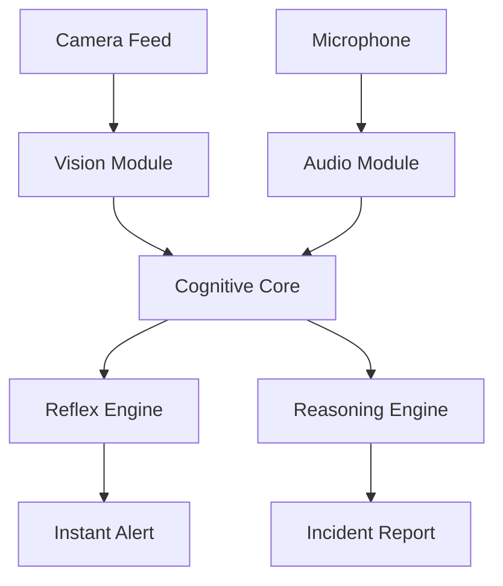

# Vital Guardian: System Architecture Overview

## 1. High-Level Design

Vital Guardian uses a **Hierarchical Fusion Architecture**. Instead of relying on a single deep learning model, it uses specialized experts (Vision, Audio) whose outputs are fused by a logical "Cognitive Core".

---

## 2. Vision Module (Visual Guardian)

The vision system is designed for **high recall** (catching every event) while relying on the Cognitive Core to filter false positives.

### 2.1 Fall Detection (V2 System)
*   **Input:** Temporal RGB Triplets (t-1, t, t+1) stacked as channels.
*   **Model:** Ensemble of 5 EfficientNet-B0 classifiers.
*   **Logic:**
    1.  **Person Detection (YOLOv8n):** Locates subject (High recall, confidence > 0.10).
    2.  **State Machine:** Tracks `IN_BED` vs `OUT_OF_BED` state.
    3.  **Encoders:** Extracts ROI and creates temporal stack.
    4.  **Inference:** 5 models vote → Average Probability.
    5.  **Smoothing:** Sliding window average (10 frames).

### 2.2 Seizure Detection (V3 System)
*   **Input:** Hybrid (Motion Analysis + Temporal RGB).
*   **Model:** Dual-Stream Ensemble.
    *   *Stream A:* Motion Magnitude verification (Rhythmic variance).
    *   *Stream B:* Temporal EfficientNet Classifier.
*   **Rhythm Verification:** Checks if keypoint variance matches seizure frequency (2-5Hz).

### 2.3 Safety Net
Deterministic logic running parallel to AI models:
*   **Bed Exit Monitor:** ROI check on bed boundary.
*   **Floor Zone:** Alerts if torso is horizontal in the bottom 20% of frame.
*   **Inactivity:** Timer triggers if subject doesn't move for 10 minutes.

---

## 3. Auditory Watchdog (Audio Module)

Provides independent corroboration for vision events.

*   **Distress Classifier:** YAMNet-based. Detects non-verbal sounds (Impact/Thud, Scream, Gasp).
*   **Keyword Spotting:** Lightweight model. Detects triggers ("Help", "Nurse", "Bachao").
*   **Interface:** Outputs JSON events `{type: "distress", sound: "thud", confidence: 0.8}`.

---

## 4. Cognitive Core (Fusion Engine)

The "Brain" that decides when to alert. Uses a **Dual-Layer** approach.

### Layer 1: Reflex Engine (The "Reptile Brain")
*   **Speed:** < 50ms.
*   **Logic:** Bayesian Scoring Matrix.
*   **Mechanism:**
    *   `Score = Vision_Conf + Audio_Conf + State_Weight`
    *   Wait 2s for audio corroboration if Vision fires alone.
    *   Output: `Alert_Level` (Info, Low, Medium, High, Critical).

### Layer 2: Reasoning Engine (The "Doctor Brain")
*   **Speed:** 2-5 seconds (Async).
*   **Tech:** LLM (Gemini 2.5 Pro).
*   **Input:** Last 60 seconds of event history as a distinct narrative.
*   **Mechanism:**
    *   Prompt: "Analyze this event log. Determine if this is a fall or false alarm."
    *   Context awareness: "Patient has high fall risk."
*   **Output:** Structured JSON for Nurse Dashboard.

---

## 5. Deployment Specs

*   **Language:** Python 3.10+
*   **Frameworks:** PyTorch (Vision), Google Generative AI (Reasoning).
*   **Hardware:**
    *   CPU: Intel Core i5+ (Real-time 10 FPS possible).
    *   GPU: Recommended for training, optional for inference (Vision runs on CPU).
    *   Cloud: Internet required for Gemini API (Reasoning Layer).
