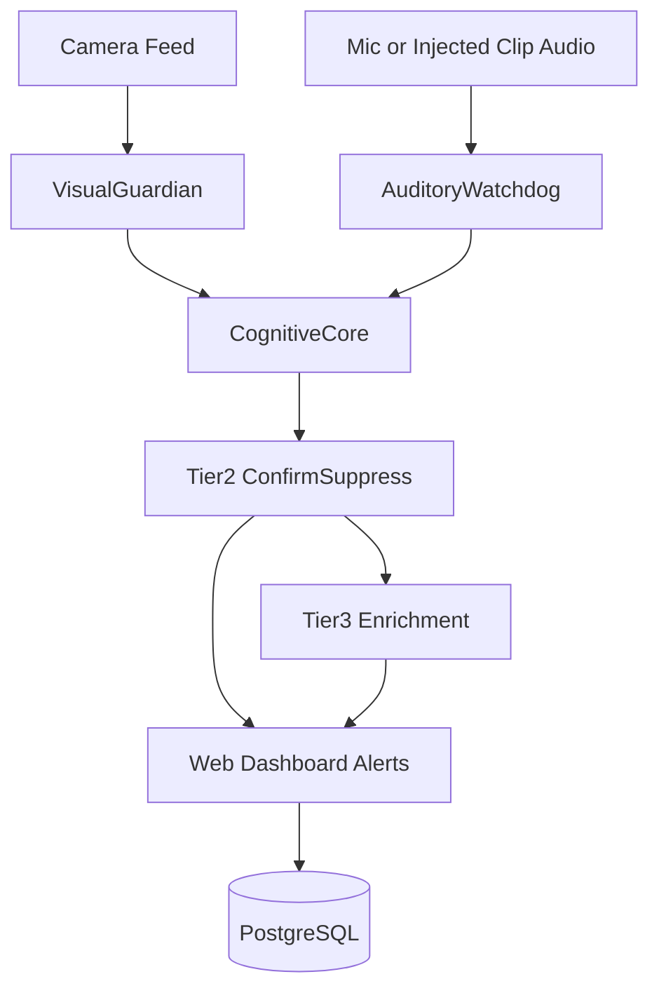

# Vital Guardian: System Architecture Overview

This document describes the current runtime architecture.

## 1. High-Level Design

Vital Guardian uses a multimodal event pipeline with progressive verification.

## 2. Vision Layer

Primary module: `visual_guardian/pipeline.py`

- shared person detector (YOLO/OpenVINO)
- temporal fall branch
- temporal seizure branch
- optional pose-driven context logic
- smoothing and stateful event emissions

Key outputs:

- `fall`, `seizure`, `normal`, `darkness`, and related context events

## 3. Audio Layer

Runtime monitor in `scripts/demo/demo_server.py` (`AuditoryMonitor`).

Sources:

- live mic stream (when `MIC_ENABLED=true`)
- injected audio chunks from demo clips

Processors:

- distress (`YAMNet`) and keyword (`Faster-Whisper`) signals
- rolling accumulation and deduplicated alert broadcasts

## 4. Cognitive Layer

`cognitive_core/gemini_verifier.py` provides two-stage verification:

- **Tier-2:** binary confirm/suppress
- **Tier-3:** structured narrative/severity/actions enrichment

High-confidence bypass logic can auto-confirm specific model outputs to reduce avoidable delay.

## 5. Runtime and Deployment Modes

### Docker mode (CPU-first)

- FastAPI app + PostgreSQL via `docker-compose.yml`
- default `OPENVINO_DEVICE=intel:cpu`
- `PERSON_DETECTOR_PROCESS_EVERY` controls detector cadence for FPS stability

### Bare-metal mode (max local vision FPS)

- run `scripts/demo/demo_server.py` directly
- set `OPENVINO_DEVICE=intel:gpu` (when available)

### Inference source mode

- `INFERENCE_MODE=LOCAL` for local fall/seizure models
- `INFERENCE_MODE=KAGGLE` for remote fall/seizure inference endpoint
